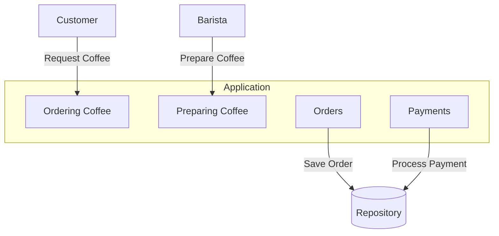

# Coffee Shop Application Example Project with Hexagonal Architecture


This project is an example of implementing the hexagonal architecture in a Spring Boot application that allows customers to order coffee and baristas to prepare it. The goal is to separate business logic from infrastructure, facilitating maintenance, testing and replacement of technologies.

# Required Technologies

 - 
 - 

# Project structure

The project is divided into two Gradle modules:

**1. coffeeshop-application:** Contains the application's business logic and use cases. This module does not depend on Spring Boot.

**2. coffeeshop-infrastructure:** Implements all adapters and adds necessary configurations for the Spring Boot application. This module depends on Spring Boot and the coffeeshop-application module.


```plaintext
├── coffeeshop-application
|   └── application
|       ├── in
|       ├── order
|       ├── out
|       └── payment
└── coffeeshop-infrastructure
    ├── adapter
    |   ├── in
    |   |   └── rest
    |   └── out
    |       └── persistence
    └── config
```

# Use cases

The main use cases od the system are:

 - **Coffee Order:** Allows the customer to order a coffee, add items to the order, cancel before payment and pay by credit card.
 - **Coffee Preparation:** Allows the barista to mark the order as ready and the customer to collect the order.



# Port and Adapters

  ### Primary ports
  
  - **OrderingCoffee:** Interface to manage coffee orders.
  - **PreparingCoffee:** Interface to manage coffee preparation.

  ### Secondary ports

  - **Orders:** Interface for order persistence.
  - **Payments:** Interface for payments persistence.


# Primary adapters

  They implement REST endpoints to receive requests and interact with the application. The controllers are thin, mapping requests to the domain and calling the primary ports.

# Secondary adapters

  They implement persistence using JPA. They translate between the domain and JPA entities.

# Domain entities

 - Order: Represents a coffee order.
 - Payment: Represents a payment.
 - Receipt: Represents a receipt.
 - LineItem: Represents an order item (type of coffee, milk, size).

# Tests

### Acceptance Tests

  Test application use cases through primary ports, ensuring business logic works correctly.

### Unitary Tests

  Focused on specific parts of the business logic, such as calculating the cost of an order.

### Integration Tests

  They test the primary and secondary adapters, checking whether the interaction with the infrastructure is correct.

### End-to-End testing

  They ensure that all system components work together correctly

# Spring Boot Configuration

  Domains classe are configured as Spring Boot beans using a custom annotation. This keeps the framework details out of the core of the application.

# How to run the project

  1. Clone this repository
  2. Navigate to the project diretory
  3. Run ``` ./gradlew bootRun  ``` to start the application or open in your favorite IDE.

# Conclusion

  This example demostrates how to apply the hexagonal architecture to a Spring Boot application, promoting separation of concerns, facilitating maintenance, and enabling effective testing.
  
